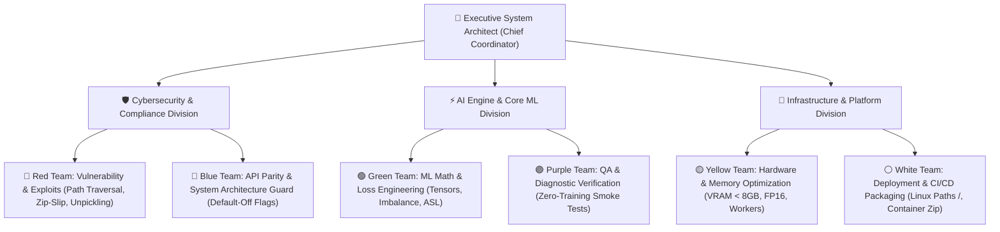

# Hierarchical Octopus Engineering Organization (v3.0 Supreme)

This framework structures automated reasoning into an **Executive Systems Hierarchy**, dividing software engineering responsibilities across specialized divisions and sub-teams:

---

## Division & Role Responsibilities

### 1. 🛡️ Cybersecurity & Compliance Division
- **🔴 Red Team Lead**: Scans all input sources for Zip-Slip (CVE-2007-4559), path traversal, command injection, and unsafe deserialization (`weights_only=True`).
- **🔵 Blue Team Lead**: Enforces baseline compatibility, ensures API contract stability, and protects baseline code paths behind `False` default flags.

### 2. ⚡ AI Engine & Core ML Division
- **🟢 Green Team Lead**: Verifies mathematical shape invariants, loss functions (ASL, Focal, BCE), class imbalance rebalancing, and gradient propagation.
- **🟣 Purple Team Lead**: Authors and executes zero-training diagnostic smoke tests (`smoke_test.py`), validating assertions in < 2 seconds on CPU/GPU.

### 3. 🔧 Infrastructure & Platform Division
- **🟡 Yellow Team Lead**: Manages VRAM allocation, gradient accumulation, mixed precision (FP16), and DataLoader shared memory (`/dev/shm`).
- **⚪ White Team Lead**: Enforces cross-platform path safety (Linux forward slashes `/`), generates platform scripts (`kaggle_notebook.py`), and builds solution archives.

---

## Executive Operating Protocol
1. **Hierarchical Approval**: Code modifications require sign-off from Red Team (Security), Blue Team (Parity), and Purple Team (QA Smoke Test).
2. **Zero-Hallucination Mandate**: Every tensor operation, file path, and API call must be verified against real codebase implementations or lightweight diagnostic scripts before execution.
3. **Automated Experiment Logging**: All cross-validation runs append metrics to `logs/ablation_results.csv`.
